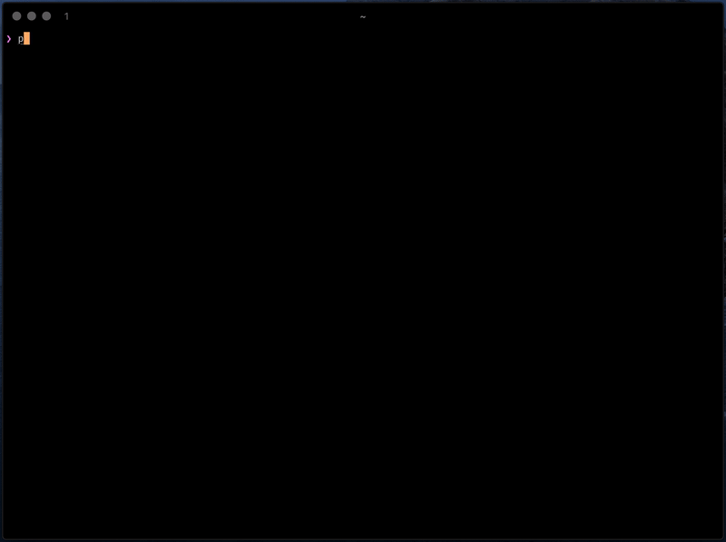

# pals
_keep in touch with friends_

this simple tool is designed to tell you about friends you don't hear from for a while.



# install
install globally via:
```
$ npm i -g @bernardini687/pals
```
if you wish to be reminded of your pals every time you open up your terminal, just add `pals` to your `rc` shell script:
```
$ echo pals >> ~/.zshrc
```

# example
say you just contacted your dear friend Jake, while the last time you've heard from Finn was on Xmas.
you could enter:
```
$ pals jake            # defaults to current date.
$ pals finn 25-12-2019
$ pals
  => Finn would love a message from you.

$ pals reset!          # wipes data.
```

# configuration
it's possible to set two environment variables to configure the behaviour:
```
export PALS_FILE=foo # sets the name of the file where the data is stored, defaults to "pals".
export PALS_DAYS=365 # sets the time you consider to be "a while", defaults to 14.
```

# details
the first time the program runs, it generates a `.pals.json` in your home folder.
that file gets written with your pals' names for keys and dates for their values.
when you run the program without arguments, it will check for any friend you haven't contacted in the last 14 days.
the program depends on [`shape-date`](https://www.npmjs.com/package/shape-date) for its amazing date-shaping possibilities. ;)
